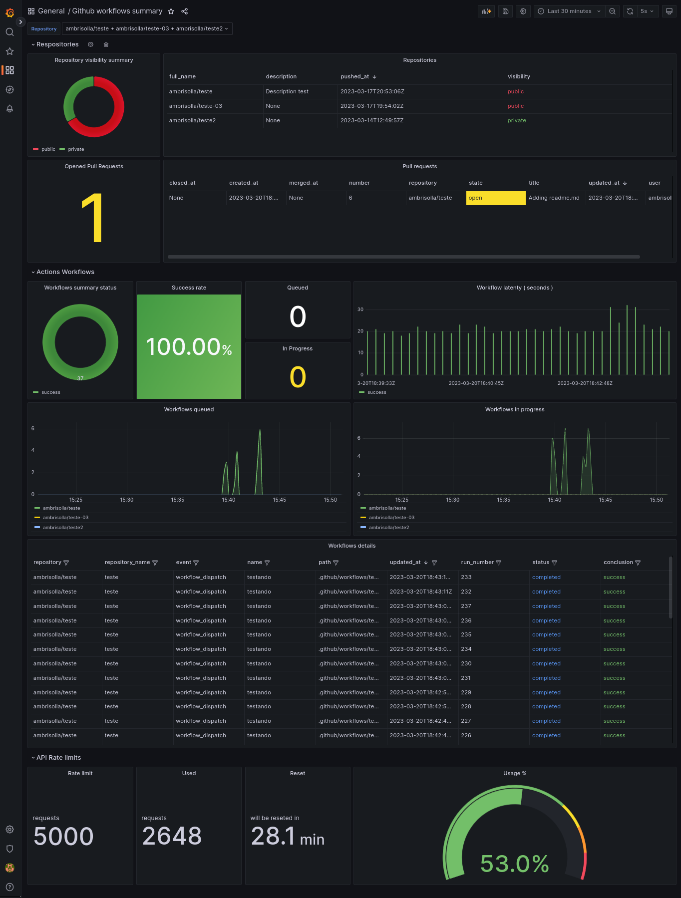

# Github Export
Prometheus exporter for Github metrics.

## Content
- [Metrics](#metrics)
- [Configurations](#configurations)
- [Installation](#installation)
- [Docker](#docker)
- [Limitations](#limitations)
- [Dashboard](#dashboard)

## Metrics

<table>
  <tr><td><b>Name</b></td><td><b>Description</b></td><td><b>Type</b></td></tr>
  <tr><td>github_actions_workflow_run</td><td>Workflow runs for a repository</td><td>Gauge</td></tr>
  <tr><td>github_actions_workflow_run_latency</td><td>Workflow runs latency for a repository</td><td>Gauge</td></tr>
  <tr><td>github_actions_workflow_runs_in_progress</td><td>Workflow runs in progress for a repository</td><td>Gauge</td></tr>
  <tr><td>github_actions_workflow_runs_queued</td><td>Workflow runs queued for a repository</td><td>Gauge</td></tr>
  <tr><td>github_pull_request</td><td>Pull Requests for a repository</td><td>Gauge</td></tr>
  <tr><td>github_repository</td><td>Get all repositories</td><td>Gauge</td></tr>
  <tr><td>github_repository_is_public</td><td>Get repository visibility info</td><td>Gauge</td></tr>
  <tr><td>github_repository_open_issues_count</td><td>Get open issues count for a repository</td><td>Gauge</td></tr>
  <tr><td>github_api_rate_limit</td><td>Get rate limit</td><td>Gauge</td></tr>
  <tr><td>github_api_rate_reset</td><td>Get when the number of used requests will be reset. </td><td>Gauge</td></tr>
  <tr><td>github_api_rate_used</td><td>Get rate used</td><td>Gauge</td></tr>
</table>

## Configurations

Configure the exporter

```yaml
token: github_token 
port: 9185 
scrap_seconds: 120 
repos: 
  - user/repo
```

#### About the configurations
- ```token```  | string : Token to be used to connect to the GitHub API
- ```port``` | int  : Port to expose exporter
- ```scrap_seconds``` | int : Exporter will analyze events between "current time and scrap_seconds"
- ```repos``` | list : Repository list to collect events data 

## Installation

#### Install requirements
```bash
$ pip install -r requirements.txt
```
#### Run exporter
```bash
$ python run.py
```

## Docker
```bash
$ docker run --name github-exporter \
  -p 9185:9185 \
  -v ./config.yaml:/app/config.yaml \
  -d andrebrisolla/github-exporter
```

## Limitations
 + <b><a href="https://docs.github.com/en/rest/rate-limit?apiVersion=2022-11-28#about-rate-limits" target="_blank">Github API rate limit</a></b>: Github API has a rate limit that limits the number of requests:
   + <b>Without token</b>: 60 requests per hour
   + <b>With a personal token</b>: 5000 requests per hour
   + <b>With a enterprise token</b>: 15000 requests per hour

It means that more repositories you have set up, more request you will spend. 

## Dashboard
The dashboard below will help you analyze the metrics collected by the exporter. [ <a href="grafana/dashboard.json">JSON file</a> ]

